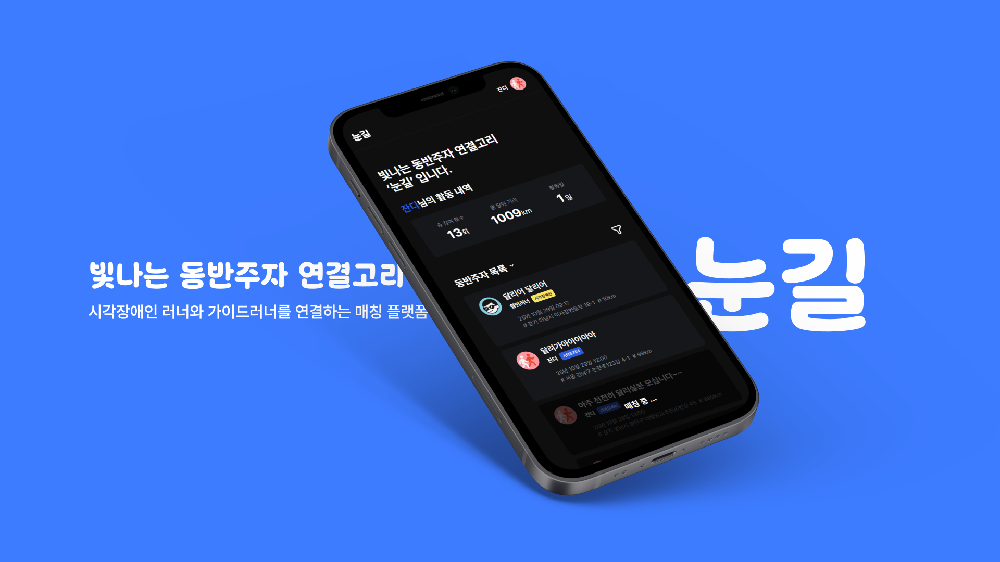
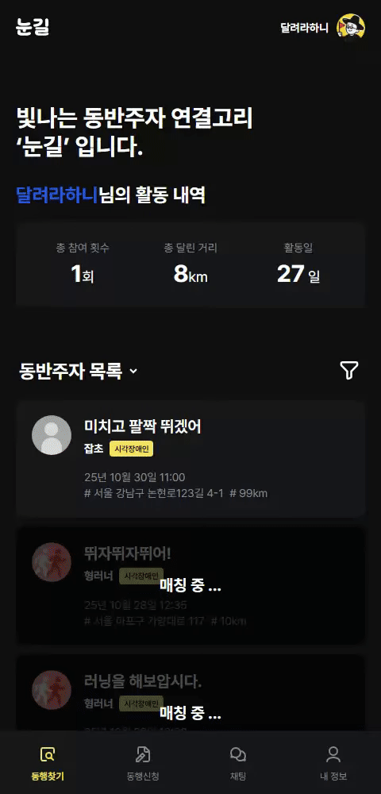
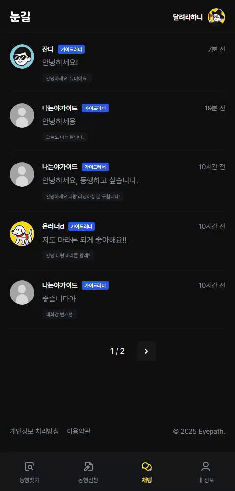
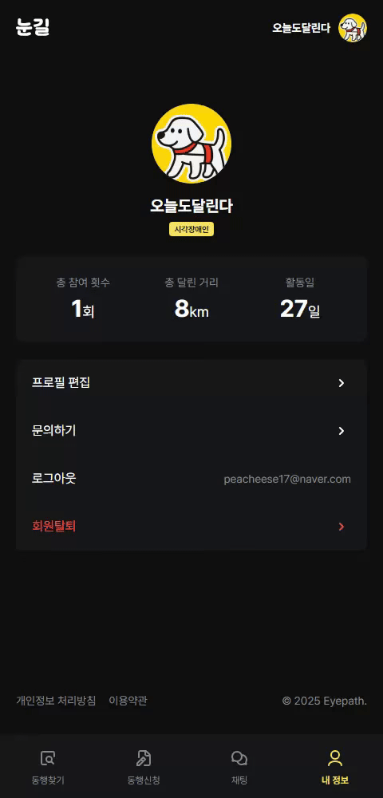
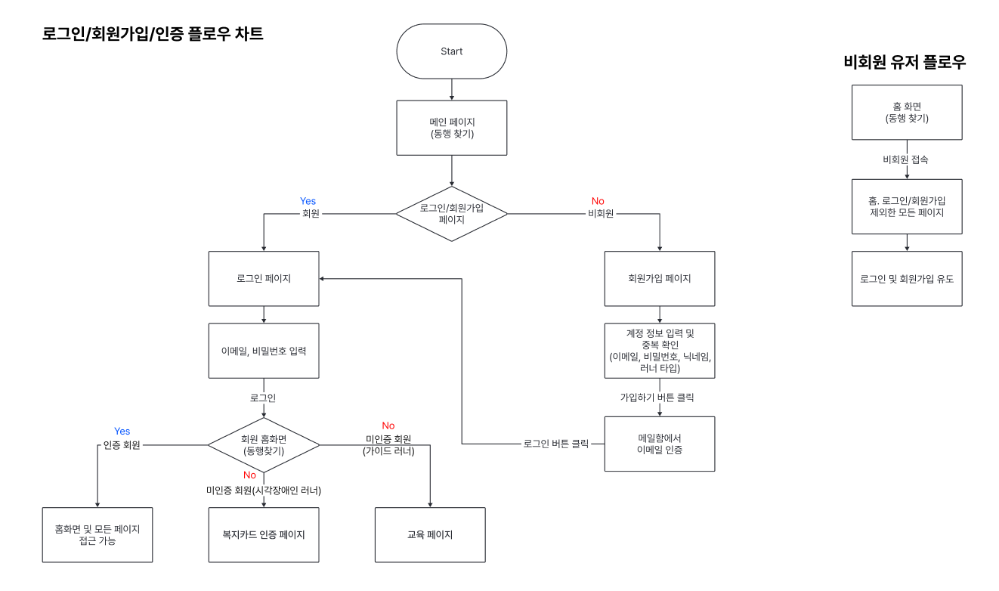
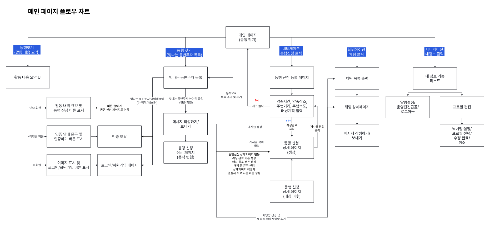
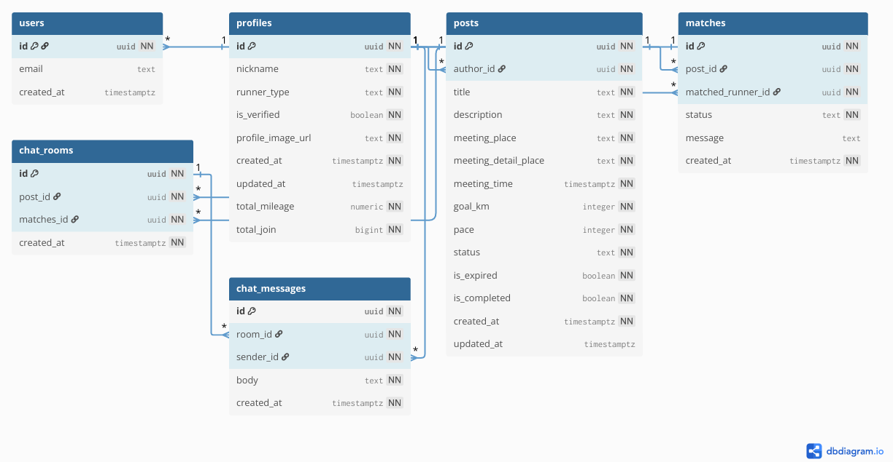

#  눈길 (Eye-Path)
> 시각장애인 러너와 가이드러너를 연결하는 매칭 플랫폼

[🔗 배포 주소 바로가기](https://eyepath.vercel.app/)

<a href="https://eyepath.vercel.app/"></a>

##  팀 소개
> 안녕하세요, 저희는 육회입니다!👋

### 팀원 소개 및 역할  

| 육회 팀원 | 전지연 | 성정은 | 이형민 | 조장원 |
| -------- | ------ | ----- | ----- | ----- |
| 역할      | PM, FE | QA, FE | 발표자, FE | PL, 디자이너, FE |
| 작업      | 채팅 | 로그인/회원가입, 내 정보 | 동행찾기, 동행신청 | 채팅 |
| GitHub    | <a href="https://github.com/jeonjyeon" target="_blank" rel="noopener noreferrer"></a> | <a href="https://github.com/jeongeunsung" target="_blank" rel="noopener noreferrer"></a> | <a href="https://github.com/hunky1st" target="_blank" rel="noopener noreferrer"></a> | <a href="https://github.com/Jandi95" target="_blank" rel="noopener noreferrer"></a> |

---

##  프로젝트 소개

### 📅 프로젝트 진행 기간
- 2025.09.24 ~ 2025.10.29

### 💡 기획 의도

**1. 문제 인식**
- 시각장애인은 **러닝을 포함한 야외 운동에 극심한 제약**을 받음
- 혼자서는 **러닝머신조차 이용이 어려운** 현실
- 장애인의 **일평균 보행 수는 비장애인보다 약 23% 적음**
- 운동량 부족으로 인한 **신체•정신 건강 저하** 우려

**2. 원인 분석**
- 개인적 제약: 시각장애 특성상 안전 확보가 어려움
- 지역적 제약: 훈련이 서울 남산 등 일부 지역에만 집중
- 구조적 제약: 가이드러너 인식·인프라 부족, 연결 경로 부재

**3. 해결 방향**
- 접근성 향상: 시각장애인이 손쉽게 가이드러너를 구할 수 있도록 연결
- 지속가능한 운동 환경: 지역 제한 없이 누구나 러닝을 이어갈 수 있는 구조
- 인식 개선: 러너 간 상호 이해와 공감 확대를 통한 사회적 통합


>이러한 문제의식과 목표를 바탕으로, 시각장애인 러너와 가이드러너가 쉽게 연결되고 소통할 수 있는 플랫폼인 눈길(EyePath)을 구현하였습니다.

### ✨ 주요 기능
| 기능                    | 설명                              |
| --------------------- | ------------------------------- |
| **동행찾기**        | 등록된 러닝 동행 모집글 목록 조회 · 필터링 및 상세보기와 게시글 편집 · 활동 통계(참여 횟수, 거리, 활동일) 확인    |
| **동행신청**         | 러닝 파트너를 구하는 모집글 작성 및 등록 기능   |
| **채팅**         | 게시글에서 이어지는 1:1 실시간 채팅 · 채팅방 목록 · 새 메시지 알림 표시   |
| **내 정보 (프로필)**     | 프로필 조회 및 편집 · 활동 통계(참여 횟수, 거리, 활동일) 확인 · 회원 탈퇴 및 문의 기능 |
| **로그인 / 회원가입**     | 이메일 기반 회원가입 및 로그인 기능 제공 |


### 🛠️ 기술 스택

| 분류             | 기술       |
| ---------------- | ---------------------------------------------------------------------------------------------------- |
| 프론트엔드       |      |
| 백엔드           |    |
| 상태 관리 도구   |   |
| 패키지 매니저    |   |
| 코드 검수        |   |
| 배포             |   |
| 버전 관리 & 협업 |     |
| 디자인           |   |

---

##  서비스 시연

### 로그인/회원가입
> 이메일을 통해 회원가입 및 로그인할 수 있습니다.  
> 회원가입 후 주요 기능(게시글 작성, 채팅 등)을 이용할 수 있습니다.


### 동행찾기 / 상세 / 편집
> 등록된 러닝 동행 모집글을 조회하고 상세 내용을 확인할 수 있습니다.  
> 게시글을 작성자 본인은 수정할 수 있으며, 신청 시 채팅이 자동 생성됩니다.


### 동행신청
> 러닝 파트너를 모집하는 게시글을 작성 및 등록할 수 있습니다.



### 채팅 목록 및 채팅
> 매칭 신청으로 생성된 1:1 실시간 채팅방에서 대화를 주고받을 수 있습니다.



### 내 정보
> 프로필 수정, 참여 통계 확인, 로그아웃 등의 기능을 제공합니다.



---

##  로드맵
> 눈길(Eye-Path)은 현재 MVP 기준으로 개발되었으며,  
> 아래 기능들은 기획 및 설계 단계에서 정의되어 있으나 추후 단계적으로 구현될 예정입니다.

| 구분 | 기능 | 설명 |
|------|------|------|
| 회원 | **회원 탈퇴 / 아이디·비밀번호 찾기** | 계정 관리 기능 고도화 — 탈퇴 및 아이디/비밀번호 찾기 로직 추가 예정 |
| 채팅 | **채팅방 자동 숨김 로직** | 러닝 완료·기간 만료·매칭 취소 시 해당 채팅방을 자동으로 목록에서 숨김 처리 |
| 알림 | **새 채팅 알림 표시 (GNB)** | 새 메시지 수신 시 GNB(하단 내비게이션)에 **빨간 점 표시**로 실시간 알림 구현 |
| 인증 | **시각장애인 인증 및 복지카드 관리 로직** | 시각장애인 사용자 인증 절차를 위한 복지카드 이미지 업로드 및 Supabase Storage 연동, 추후 관리 페이지 추가 예정 |
| 교육 | **가이드러너 교육 이수 로직** | 가이드러너로 가입 후, 안전 교육 콘텐츠 및 인증 절차를 통해 활동 권한 부여 |
| 데이터 | **시각장애인 복지카드 첨부 및 이미지 DB 저장** | 인증 과정에서 첨부된 복지카드 이미지를 Supabase Storage에 안전하게 저장 및 관리 |

---

##  프로젝트 구조 및 실행

###  프로젝트 구조
```bash
project/
├── public                 / # 정적 파일 (이미지, 폰트 등)
├── src
│ │
│ ├── app                  / # Next.js App Router 기반 페이지 및 라우팅 폴더
│ │ ├── auth               / # 인증 관련 페이지 (로그인, 회원가입 등)
│ │ ├── chat               / # 실시간 채팅 관련 페이지
│ │ ├── legal              / # 약관, 개인정보처리방침 등 법적 문서 페이지
│ │ ├── post               / # 게시글 작성/조회 관련 페이지
│ │ ├── profile            / # 사용자 프로필 관련 페이지
│ │ ├── test               / # 테스트용 페이지 (개발 중 실험 영역)
│ │ ├── error.tsx          / # 전역 에러 페이지 (Next.js 자동 사용)
│ │ ├── globals.css        / # 전역 스타일 (Tailwind, Reset, 공통 CSS)
│ │ ├── icon.svg
│ │ ├── layout.tsx         / # 모든 페이지 공통 레이아웃 컴포넌트
│ │ └── page.tsx           / # 루트 페이지(post 페이지로 redirect) 
│ │
│ ├── components           / # 재사용 가능한 UI 컴포넌트
│ │ ├── common             / # 버튼, 인풋 등 공통 컴포넌트
│ │ ├── dialogs            / # 모달 다이얼로그 관련 컴포넌트
│ │ ├── global-nav         / # 최하단 메인 내비게이션 관련 UI
│ │ ├── layout             / # 페이지 전용 레이아웃 구성 컴포넌트
│ │ ├── pagination         / # 페이지네이션 관련 UI
│ │ └── toast              / # 토스트 메시지, 알림 관련 컴포넌트
│ │
│ ├── constant             / # 상수, 컬러 설정값 등 정의
│ ├── stores               / # 상태 관리 관련 (Zustand)
│ └── utils                / # 유틸 함수, 공통 로직, 슈퍼베이스 등
│
├── .env.local             / # 환경 변수 설정 (API 키, DB URL 등)
├── .gitattributes         / # Git 속성 정의
├── .gitignore             / # Git에서 제외할 파일 목록
├── biome.json             / # 코드 포맷팅 / 린팅 설정 (Biome = Prettier + ESLint 대체)
├── bun.lock
├── middleware.ts          / # Next.js 미들웨어 (인증, 리다이렉트, 로깅 등)
├── next-env.d.ts
├── next.config.ts
├── package.json
├── postcss.config.mjs
├── README.md              / # 프로젝트 개요 및 실행 방법 문서
└── tsconfig.json
```

### 🔎 실행 방법

```bash
# 1. 프로젝트 클론
git clone https://github.com/your-repo/eyepath.git
cd eyepath
```

```bash
# 2. 패키지 설치
bun install
```

```bash
# 3. .env.local 파일에 환경 변수 설정
NEXT_PUBLIC_SUPABASE_URL
NEXT_PUBLIC_SUPABASE_API_KEY
SUPABASE_SERVICE_ROLE_KEY
```

```bash
# 4. 개발 서버 실행
bun dev
```

#### ⚙️ 기타 명령어
| 목적         | 명령어               | 설명                                          |
| ---------- | ----------------- | ------------------------------------------- |
| 코드 품질 검사 | `bun lint`    | Biome 기반 린트 검사 (`biome check`)              |
| 코드 포맷팅  | `bun format`  | Biome 자동 포맷 (`biome format --write`)        |
| 프로덕션 빌드 | `bun prod`    | Next.js 빌드 생성 (`next build`)                |
| 빌드 미리보기 | `bun preview` | 빌드된 앱을 4000번 포트에서 실행 (`next start -p 4000`) |

---

##  서비스 흐름도 (Flow Chart)
> 사용자 → 게시글 → 채팅 → 연결까지의 서비스 플로우를 시각화했습니다.




---

##  데이터베이스 구조 (ERD)
> 주요 테이블 및 관계 구조를 ERD로 정리했습니다.

